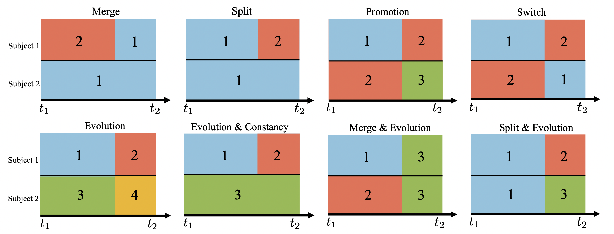

# Doubly Inhomogeneous Reinforcement Learning

This repository contains the implementation for the paper "Doubly Non-homogeneous Reinforcement Learning" in Python (and R for plotting). The main challenge lies in that not only each subject can have their own system dynamics, but the system dynamics may evolve over time for each subject. In this work, we assume that at each time point, subjects can be grouped into clusters defined by their system dynamics. We provide some concrete examples  with two subjects and a single change point (including **merge**, **split**, **promotion**, **evolution**, etc.) to elaborate.




**Figure 1**: Basic building blocks with two subjects (one in each row) and a single change point. Different dynamics are represented by distinct colors.

## File Overview 

### `functions/` Directory
This directory contains utility functions for the numerical experiments, including simulation and data analysis tasks:

* `simu_mean_detect.py`: Implements the proposed change point and cluster detection method for non-homogeneous environments.
* `compute_test_statistics_separateA.py`: Computes the optimal policy.
* `evaluation.py`: Implements the evaluation procedure, including functions to estimate the optimal policy and assess its value using fitted-Q evaluation.
* `simulate_data_1d.py`: Generates data based on the provided transition and reward functions.

### `realdata_2020/` Directory
This directory houses the platform used to analyze the IHS 2020 study, as discussed in Section 3.1 of the paper:

* `realdata.py`: Detects change points and clusters in the training data, and evaluates the trained policies on testing data.
* `create_realdata.sh`: Creates SLURM jobs to run `realdata.py`.
* `collect_res.py` and `create_collectres.sh`: Collect and summarize results from the real data analysis.
### `semisyn_2020/` Directory
This directory contains the platform for the IHS simulation described in the paper. It is divided into two subdirectories:

#### `offline/` (for Section 5.1)
* `offline.py`: Simulates 3-dimensional data based on the fitted model from IHS 2020 data, incorporating the detected change points and clusters.
* `create_offline.sh`: Creates SLURM jobs to run `offline.py`.
* `collect_res.py` and `create_collectres.sh`: Collect and summarize results from the offline estimation.
#### `online_value/` (for Section 5.2)
* `run_value.py`: Estimates the value of different policies in a doubly inhomogeneous environment.
* `create_value.sh`: Creates SLURM jobs to run `run_value.py`.
* `collect_res.py` and `create_collectres.sh`: Collect and summarize results from the online evaluation.


<!-- - Folder `simulations/`: This folder contains the platform that realizes the 1-dimensional simulation in the paper. Files starting with `plot` in their names contain codes to generate plots in the paper. 
    - Folder `final_perf/`: This folder contains the code for offline estimation in Section 5.1.1 and Section 5.1.2.
        - `run_maxiter.py` simulates 1-dimensional data with different-sign transition functions and test for double non-homogeneity. Usage:
        ```console
        python 01_sim_1d_run.py {init} {N} {T} {setting} {nthread} {cov} {threshold_type} {K} {max_iter} {random_cp}
        ```
        See the annotation in the script for the meanings of arguments. Example:
        ```console
        python 01_sim_1d_run.py kmeans 50 50 pwconst2 8 0.25 maxcusum 2 10 0
        ```
        - `run_maxiter_samesign.py` simulates 1-dimensional data with same-sign transition functions and test for double non-homogeneity.
        - `collect_results.py` collect simulation results of the performance of the proposed method to generate Figure 3 and Figure 4 in the paper.
        - `collect_results.py` collect simulation results of the performance of the proposed method given numbers of clusters when the transition functions of the two clusters have the same sign on the interaction term.
        - `plot_suppC1_cp.py` creates the supplement Figure C1 of the estimation performance the proposed method given different initial change point locations. 
        - `plot_suppC2_K.py` creates the supplement Figure C2 of the estimation performance the proposed method given different numbers of clusters. 
        - To run the 1-dimensional simulation in sequence, 
        ```sh
        bash create_maxiter.sh
        bash create_maxiter_samesign.sh
        ```
    - Folder `value/`: This folder contains the code for online evaluation in Section 5.1.2.
        - `run_value.py` estimates the value of different policies in environment where different clusters have different signs on the interaction term in the transition functions.
        - `run_value_samesign.py` estimates the value of different policies in environment where different clusters have the same sign in the interaction term in the transition functions.
        - `collect_results.py` collect simulation results of the value of the proposed method when the transition functions of the two clusters have different signs on the interaction term. 
        - `collect_results_samesign.py` collect simulation results of the value of the proposed method when the transition functions of the two clusters have the same sign on the interaction term. 
        - `plot_value.py` creates Figure 5 in the paper and the Figure 1 in the supplement of value difference distribution. 
        - To run the evaluation in sequence, 
        ```sh
        bash create_value.sh
        bash create_value.samesign.sh
        ```
   
- Folder `output` contains raw results and corresponding figures of the simulation in the paper. -->
